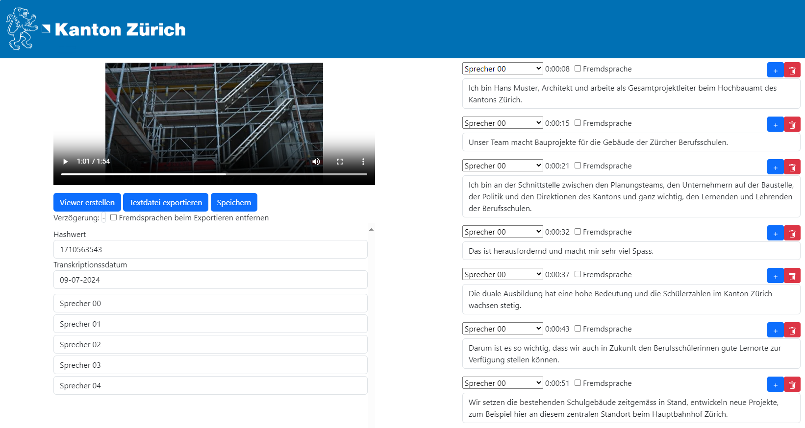

# Audio Transcription Tool «TranscriboZH»
**Transcribe any audio or video file. Edit and view your transcripts in a standalone HTML editor.**


[](https://github.com/machinelearningZH/audio-transcription)
[](https://github.com/machinelearningZH/audio-transcription/stargazers)
[](https://github.com/machinelearningZH/audio-transcription/issues)
[](https://img.shields.io/github/issues-pr/machinelearningZH/audio-transcription) 
[](https://github.com/machinelearningZH/audio-transcription)
<a href="https://github.com/astral-sh/ruff"></a>




<details>

<summary>Contents</summary>

- [Setup Instructions](#setup-instructions)
    - [Hardware requirements](#hardware-requirements)
    - [Installation](#installation)
    - [Running the Application](#running-the-application)
    - [Configuration](#configuration)
- [Project Information](#project-information)
    - [What does the application do?](#what-does-the-application-do)
- [Project team](#project-team)
- [Feedback and Contributions](#feedback-and-contributions)
- [Disclaimer](#disclaimer)

</details>

## Setup Instructions
### Hardware requirements
- We strongly recommend using a CUDA-compatible graphics card, as transcription on a CPU is extremely slow.
    - https://developer.nvidia.com/cuda-gpus
- If you are using a graphics card, you need at least 8GB VRAM. Performance is better with 16GB VRAM.
- 8GB RAM

### Docker
- Install docker (on Windows use WSL2 backend)
- Run `docker-compose up -d --build`
  
### Installation
- Ensure you have a compatible NVIDIA driver and CUDA Version installed: https://pytorch.org/
- Install ffmpeg
    - Windows: https://phoenixnap.com/kb/ffmpeg-windows
    - Linux (Ubuntu): `sudo apt install ffmpeg`
- Install conda
    - Windows:
        - Install [Anaconda](https://docs.anaconda.com/free/anaconda/install/) or [Miniconda](https://docs.conda.io/projects/miniconda/en/latest/).
    - Linux (Ubuntu):
        - `mkdir -p ~/miniconda3`
        - `wget https://repo.anaconda.com/miniconda/Miniconda3-latest-Linux-x86_64.sh -O ~/miniconda3/miniconda.sh`
        - `bash ~/miniconda3/miniconda.sh -u`
        - `rm ~/miniconda3/miniconda.sh`
        - Close and re-open your current shell.
- Create a new Python environment, e.g.: `conda create --name transcribo python=3.10`
- Activate your new environment: `conda activate transcribo`
- Clone this repo.
- Install packages:
    - Check the installed cuda version: `nvcc --version`
    - Run the following command with your specific cuda version. **This example is for cuda version 11.8, edit the command for your installed version**.
    - `conda install pytorch==2.1.2 torchvision==0.16.2 torchaudio==2.1.2 pytorch-cuda=11.8 -c pytorch -c nvidia`
    - `pip install -r requirements.txt`
- Make sure, that the onnxruntime-gpu package is installed. Otherwise uninstall onnxruntime and install onnxruntime-gpu (if in doubt, just reinstall onnxruntime-gpu)
    - `pip uninstall onnxruntime`
    - `pip install --force-reinstall onnxruntime-gpu`
    - `pip install --force-reinstall -v "numpy==1.26.3"`
- Create a Huggingface access token
    - Accept [pyannote/segmentation](https://huggingface.co/pyannote/segmentation)) user conditions
    - Accept [pyannote/speaker-diarization-3.0](https://huggingface.co/pyannote/speaker-diarization) user conditions
    - Create access token at [hf.co/settings/tokens](https://hf.co/settings/tokens) with read and write permissions.
- Create a `.env` file and add your access token. See the file `.env_example`.
```
    HF_AUTH_TOKEN = ...
```
- Edit all the variables of `.env_example` in your `.env` file for your specific configuration. Make sure that your `.env` file is in your `.gitignore`.

### Running the Application
Start the worker and frontend scripts:
- Linux
    - `tmux new -s transcribe_worker`
    - `conda activate transcribo`
    - `python worker.py`
    - Exit tmux session with `CTRL-B` and `D`.
    - `tmux new -s transcribe_frontend`
    - `conda activate transcribo`
    - `python main.py`
    - You can restore your sessions with `tmux attach -t transcribe_worker` and `tmux attach -t transcribe_frontend`
- Windows
    - See `run_gui.bat`, `run_transcribo.bat` and `run_worker.bat`
    - Make sure not to run the worker script multiple times. If more than one worker script is running, it will consume too much VRAM and significantly slow down the system.

### Configuration
|   | Description |
|---|---|
| ONLINE | Boolean. If TRUE, exposes the frontend in your network. For https, you must provide a SSL cert and key file. See the [nicegui](https://nicegui.io/documentation/section_configuration_deployment) documentation for more information |
| SSL_CERTFILE | String. The file path to the SSL cert file |
| SSL_KEYFILE | String. The file path to the SSL key file |
| STORAGE_SECRET | String. Secret key for cookie-based identification of users |
| ROOT | String. path to main.py and worker.py |
| WINDOWS | Boolean. Set TRUE if you are running this application on Windows. |
| DEVICE | String. 'cuda' if you are using a GPU. 'cpu' otherwise. |
| ADDITIONAL_SPEAKERS | Integer. Number of additional speakers provied in the editor |
| BATCH_SIZE | Integer. Batch size for Whisper inference. Recommended batch size is 4 with 8GB VRAM and 32 with 16GB VRAM. |


## Project Information
This application provides advanced transcription capabilities for confidential audio and video files using the state-of-the-art Whisper v3 large model (non-quantized). It offers top-tier transcription quality without licensing or usage fees, even for Swiss German.

### What does the application do?
- State-of-the-Art Transcription: Powered by Whisper v3 large model, ensuring high accuracy and reliability.
- Cost-Free: No license or usage-related costs, making it an affordable solution for everyone.
- High Performance: Transcribe up to 15 times faster than real-time, ensuring efficient processing.
- High-Quality Transcriptions: Exceptional transcription quality for English and local languages, with substantial accuracy for Swiss German.
- Speaker Diarisation: Automatic identification and differentiation of speakers within the audio.
- Multi-File Upload: Easily upload and manage multiple files for transcription.
- Predefined vocabulary: Define the spelling of ambiguous words and names.
- Transcript Export Options: Export transcriptions in various formats:
    - Text file
    - SRT file (for video subtitles)
    - Synchronized viewer with integrated audio or video
- Integrated Editing: Edit transcriptions directly within the application, synchronously linked with the source video or audio. The editor is open-source and requires no installation.
    - General Text Editing Functions: Standard text editing features for ease of use.
    - Segments: Add or remove speech segments.
    - Speaker Naming: Assign names to identified speakers for clarity.
    - Power User Shortcuts: Keyboard shortcuts for enhanced navigation and control (start, stop, forward, backward, etc.).


## Project team
This project is a collaborative effort of these people of the cantonal administration of Zurich:

- **Stephan Walder** - [Leiter Digitale Transformation, Oberstaatsanwaltschaft Kanton Zürich](https://www.zh.ch/de/direktion-der-justiz-und-des-innern/staatsanwaltschaft/Oberstaatsanwaltschaft-des-Kantons-Zuerich.html)
- **Dominik Frefel** - [Team Data, Statistisches Amt](https://www.zh.ch/de/direktion-der-justiz-und-des-innern/statistisches-amt/data.html)
- **Patrick Arnecke** - [Team Data, Statistisches Amt](https://www.zh.ch/de/direktion-der-justiz-und-des-innern/statistisches-amt/data.html)
  
## Feedback and Contributions
Please share your feedback and let us know how you use the app in your institution. You can [write an email](mailto:datashop@statistik.zh.ch) or share your ideas by opening an issue or a pull requests.

Please note, we use [Ruff](https://docs.astral.sh/ruff/) for linting and code formatting with default settings.

## Disclaimer
This transcription software (the Software) incorporates the open-source model Whisper Large v3 (the Model) and has been developed according to and with the intent to be used under Swiss law. Please be aware that the EU Artificial Intelligence Act (EU AI Act) may, under certain circumstances, be applicable to your use of the Software. You are solely responsible for ensuring that your use of the Software as well as of the underlying Model complies with all applicable local, national and international laws and regulations. By using this Software, you acknowledge and agree (a) that it is your responsibility to assess which laws and regulations, in particular regarding the use of AI technologies, are applicable to your intended use and to comply therewith, and (b) that you will hold us harmless from any action, claims, liability or loss in respect of your use of the Software.
